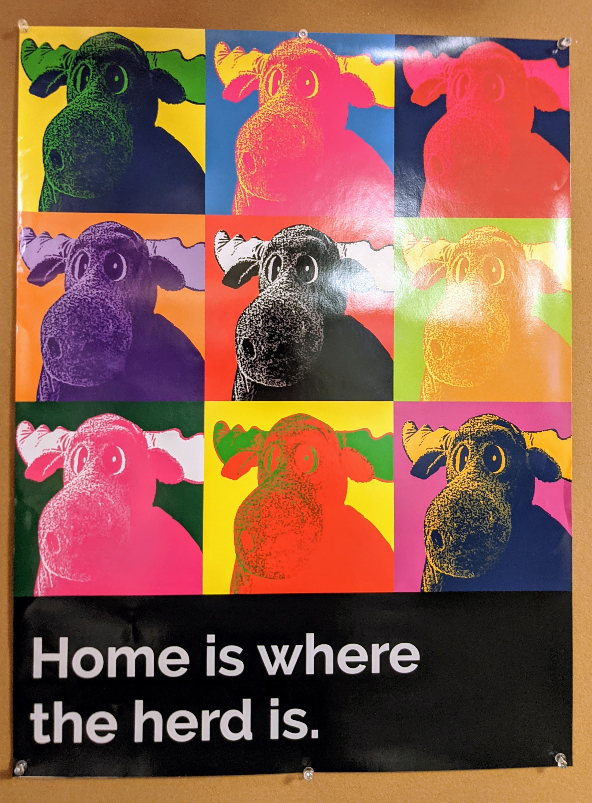

```{r setup, include=FALSE}
knitr::opts_chunk$set(echo = T)
```

```{r echo=F}
library(tidyverse)
library(rnaturalearth)
library(sf)
library(ggthemes)
library(leaflet)
library(leaflet.extras2)
#library(plotly)
#library(gganimate)  # also requires transformr
```

We want to animate people's locations over the past few months.

```{r}
t <- "20201227_235052"
data.locations <- readRDS(paste("data/locations_", t, ".rds", sep=""))
```

```{r layout="l-page"}
d <- data.locations %>%
    mutate(time=as.Date(Day, origin="2020-01-01", tz=UTC)) %>%
    st_jitter(factor=0.0001) %>%  # For respondents whose locations stay constant for a while
    split(data.locations$ID)

leaflet() %>%
    addProviderTiles(providers$Stamen.Watercolor) %>%
    addPlayback(data=d,
                options=playbackOptions(radius=1, tracksLayer=F, dateControl=T,
                                        tickLen=1000*60*60*24/4,  # 1/4 day
                                        speed=1*60*60*24*35,  # 7 day/sec
                                        maxInterpolationTime=1000*60*60*24*365,
                                        staleTime=10000000000000000*60*60*24*365))
```

```{r eval=F}
# data <- sf::st_as_sf(leaflet::atlStorms2005[1:5,])
# data$Name <- as.character(data$Name)
# data <- st_cast(data, "POINT")
# data <- split(data, f = data$Name)
# lapply(1:length(data), function(x) {
#   data[[x]]$time <<- as.POSIXct(
#     seq.POSIXt(Sys.time()-365*24*60*60*1000, Sys.time(), length.out = nrow(data[[x]])), tz="UTC")
# })
# 
# leaflet() %>%
#   addTiles() %>%
#   addPlayback(data = data,
#               options = playbackOptions(radius = 3, tickLen=24*60*60*1000,
#                                         color = c("red","green","blue", "orange","yellow")),
#               pathOpts = pathOptions(weight = 5))

## Single Elements
data <- sf::st_as_sf(leaflet::atlStorms2005[1,])
data <- st_cast(data, "POINT")
data$time = as.POSIXct(
  seq.POSIXt(from=Sys.time()-1*60*60*24*365, to=Sys.time(), length.out = nrow(data)))

leaflet() %>%
  addTiles() %>%
  addPlayback(data = data,
              options = playbackOptions(radius=3, tickLen=1000*60*60*24,
                                        maxInterpolationTime=1000*60*60*24*100,
                                        speed=1000000*60*60*24),
              pathOpts = pathOptions(weight = 5))

d <- data.locations.conn %>%
    filter(ID == "R_yr6nbKVs9yEjg9r") %>%
    mutate(time=as.POSIXct(as.Date(Day, origin="2020-01-01"), tz=UTC)) %>%
    select(time, geometry)

leaflet() %>%
    addPlayback(data=d,
                options = playbackOptions(radius=3, tickLen=1000*60*60*24,
                                        maxInterpolationTime=1000*60*60*24*365,
                                        speed=1000*60*60*24,
                                        staleTime=1000*60*60*24*365),
              pathOpts = pathOptions(weight = 5))
```

```{r eval=F, echo=F}
world <- ne_countries(scale="medium", returnclass="sf")
usa_states <- ne_states("united states of america", returnclass="sf")

library(leaflet)
library(leaftime)
leaflet() %>%
    addPolygons(data=world, smoothFactor=1, fillColor="#aaa", fillOpacity=1,
                weight=1, opacity=1, color="#111") %>%
    addPolylines(data=usa_states, smoothFactor=1, weight=1, opacity=1, color="#222")
```

There are two similar approaches. The software library plotly offers a pretty nice way to turn ggplots into interactive visualizations which can can animate through time. Unfortunately, it currently appears to be a limitation that the animation slider's breakpoints must be evenly spaced.^[https://stackoverflow.com/questions/65334985/how-to-customize-plotly-r-ggplot2-animation-breakpoints-frame-spacing-duration] This is undesirable for us, since our waypoints and epochs are not evenly-spaced. Using day of the year seems misleading in this case, and a full English description of the epoch/waypoint is too long to fit, so we use an abbreviated Epoch/Waypoint label. Refer to the table below for the date/season itself.

```{r layout="l-body-outset", eval=F}
bbox <- st_bbox(data.locations.conn)
l_jitter <- data.locations.conn %>%
    st_jitter(factor=0.0002) %>%
    mutate(Year=as.factor(Year))  # Setting year as factor lets us toggle year in the plotly map

g <- ggplot(data=NULL) +
    geom_sf(data=world, fill="white", color="black", size=0.4) +
    geom_sf(data=usa_states, fill="white", color="grey", size=0.4) +
    geom_sf(data=l_jitter, aes(frame=TimeEW, ids=ID, color=Year), alpha=0.9) +
    scale_color_brewer(palette="Spectral") +
    lims(x=c(bbox$xmin - 1, bbox$xmax + 1), y=c(bbox$ymin - 1, bbox$ymax + 1)) +
    labs(title="Movements of Students in Stiles through 2020", subtitle="Interactive map") +
    theme_tufte() +
    theme(axis.text=element_blank(), axis.ticks=element_blank(), axis.title=element_blank())

ggplotly(g, tooltip=c("Year", "Connectedness")) %>%
    animation_opts(redraw=F, frame=800) %>%
    animation_slider(currentvalue=list(prefix="Time ", font=list(color="black")))
```

* t1 is before Spring Break (< 3/7)
* t2 is Spring Break week 1 (3/7 - 3/15)
* t2.5 is Spring Break week 2 (3/16 - 3/22)
* t3 is remainder of semester (3/23 - 5/6)
* t4 is Summer (5/7 - Aug)
* t5 is Fall semester, before break (8/31 - 11/21)
* t6 is remainder of Fall semester (11/22 - 2020)

If we sacrifice the interactiveness, a more true-to-time visualization is given by ``gganimate``.

```{r eval=F}
epoch_days <- c("1"=13, "2"=67, "2.5"=76, "3"=83, "4"=128, "5"=244, "6"=327, "7"=365)
day2season <- function(d) {
    d <- as.numeric(d)
    if (d < epoch_days["2"])   return("Spring Semester, before Break")
    if (d < epoch_days["2.5"]) return("Spring Break Week 1")
    if (d < epoch_days["3"])   return("Spring Break Week 2")
    if (d < epoch_days["4"])   return("Rest of Spring")
    if (d < epoch_days["5"])   return("Summer")
    if (d < epoch_days["6"])   return("Fall Semester, before Break")
    if (d <= epoch_days["7"])  return("Rest of 2020")
    return(NA)
}
day2date <- function(d) {
    return(format(as.Date(toString(round(d)), format = "%j", origin="12-31-2019"), "%b %d"))
}

g2 <- g +
    labs(title="Movements of Students in Stiles through 2020",
        subtitle="{day2date(frame_time)} \t~ \t{day2season(frame_time)}") +
    transition_time(Day) +
    ease_aes("sine-out")

animate(g2, fps=10, nframes=260, end_pause=10)  # Requests an fps which divides 100
# ? https://stackoverflow.com/a/61763614/14841573
```

```{r fig.cap='A poster outside the Stiles dining hall reads, "home is where the herd is." ', echo=F}

```